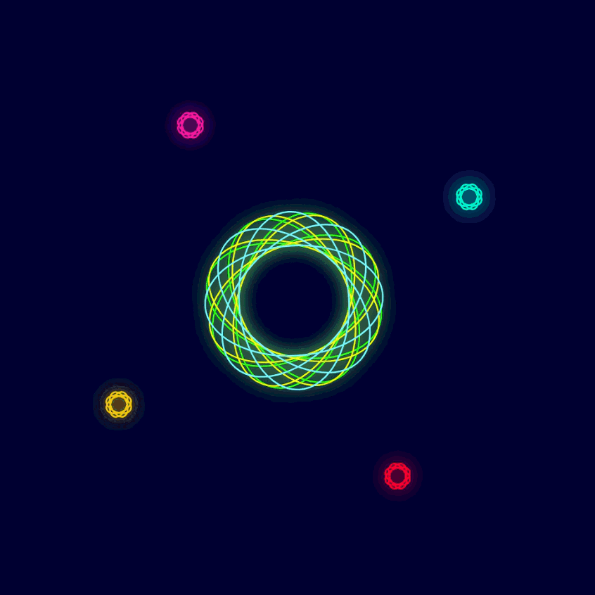

# Polar-Memories-Generative-Art

A collection page for **Polar Memories** — six works drawn with the p5.Polar library, presented as a collection with a works grid, surfaces, process, and commission sections.

**Live:** `https://reyrove.github.io/Polar-Memories-Generative-Art/`

---

## Overview

**Polar Memories** is a collection of six works, each drawn with the **p5.Polar library** — a p5.js extension that places shapes around a polar centre by angle and radius, rather than x and y. The collection includes four still images (PNG) and three animated GIFs of the same polar compositions rotating in neon light.

Every work in the collection is built from the same small vocabulary of primitives — **hexagons, ellipses, triangles, polygons, and lines** — arranged around a polar centre. The compositions explore different palettes, different rotations, and different motion directions, but always work with the same mathematical language.

The page functions as a **collection and licensing surface** for fashion houses, textile studios, and surface designers. All six works are available to license individually or as a set.

---

## What Makes This Collection Different

**Polar Memories** sits alongside the artist's other collections (Skyline, Portrait, Girih, Gothic Grid, Matrix Rain, Organic Shapes, Recursive Grid, Generative Lifeform, Game of Seeds, Fibonacci's Spin) but has a distinct character:

| Collection | Format | Character |
|-----------|--------|-----------|
| **Skyline Series** | Generative system | Themed cityscapes, seed-based |
| **Fibonacci's Spin** | Two fixed editions | Fibonacci orbit, animated GIFs |
| **Polar Memories** | Six mixed works | p5.Polar geometry, stills + GIFs |

Where the generative collections offer infinite variations from a seed, and Fibonacci's Spin offers two fixed editions, **Polar Memories** offers **six compositions built from a shared library** — some still, some animated. The collection reads as a **walkthrough** of the p5.Polar vocabulary.

---

## The Six Works

### 01 / Am I Simple?! — still

> In the simplicity of your essence, you ask, "Am I simple?" Yet, your spirit is a colourful tapestry woven with intricate lines, painting a vibrant portrait amidst the squares of life. Like a polar hexagon, you stand unique and resilient, radiating a spectrum of emotions in hues of green, red, and blue.

**Primitives:** Hexagons · **Palette:** Green / Red / Blue · **Format:** PNG

### 02 / Maybe Another Time… — still

> In the polar twilight, where emotions intertwine, maybe another time, our destinies align. Squares and circles dance, a geometric rhyme, casting a glow, a tapestry in red and green prime. Yellow, purple, blue — a kaleidoscope so bright.

**Primitives:** Triangles / Polygons / Lines · **Palette:** Full spectrum · **Format:** PNG

### 03 / Nature Dance — animated

> In the dance of nature, the sky wears a robe of blue, glassy reflections shimmer in a greenish hue. Rotation whispers secrets in shades of red, as the sun dips low, painting the world in fiery threads. A ballet of colours, a dance of grace.

**Primitives:** Polygons (with rotation) · **Palette:** Blue / Green / Red · **Format:** GIF

### 04 / Cosmic Casino — animated

> In the realm of codes, where neon lights gleam, a dice in disturbia, a cryptic dream. Chance weaves a game, a dance so polar, as random whispers echo, a mystical collar. A game of chance, where destinies entwine.

**Primitives:** Ellipses / Squares / Triangles · **Palette:** Neon filter · **Format:** GIF · **3D box rotation**

### 05 / Elements — animated

> In the celestial expanse governed by the polar ellipse, a captivating saga of creation unfolded. From the elemental chaos emerged the seeds of life, a mesmerising journey guided by the unseen forces of the universe. Twenty-eight polar ellipses rotating towards the centre.

**Primitives:** 28 polar ellipses · **Palette:** Neon with green-yellow core · **Format:** GIF · 15 fps · 10 seconds

### 06 / Emerald's Leap — still

> Emerald wasn't your average garden spider. While her kin spun intricate webs of glistening silver, Emerald's heart yearned for something more than catching prey. Her emerald body, vibrant against the green leaves, craved adventure.

**Primitives:** Polar polygons · **Palette:** Emerald / Green · **Format:** PNG

Each work is accompanied by a **written story** — the short prose pieces above are the openings of each. The full stories live on the individual work pages.

---

## The p5.Polar Library

Every work in the collection is built with **p5.Polar**, a p5.js library that abstracts polar geometry into simple primitives. Instead of manually computing `cos(θ)` and `sin(θ)`, the library lets you place shapes directly:

```js
// Vanilla p5.js — placing a triangle at angle θ, radius r
let x = cx + cos(theta) * r;
let y = cy + sin(theta) * r;
triangle(x, y, size);

// p5.Polar — same triangle
polarTriangle(cx, cy, r, theta, size);
```

This makes **radial compositions** — sunflowers, spiderwebs, mandalas, galaxies — as easy to draw as any other shape. That's why every work in this collection has a radiating structure: the library is designed for it.

---

## Features of the Collection Page

### Hero

A single square canvas displaying the **Elements** GIF — the most cosmic of the six works, and the one that best represents the collection's range.

### Works Grid

A 2 × 3 grid showing all six works, each as a card with:

- A live GIF or still preview (loaded from `/images/`)
- The work title in Cormorant Garamond
- The story opening in DM Mono
- Four metadata rows: primitives, palette, medium, format

### Surfaces Section

Three of the six works — **Am I Simple?!**, **Nature Dance**, and **Elements** — are shown across four surfaces each:

- **Print** (1:1) — `background-size: contain`
- **Scarf** (3:1) — three repeats horizontally
- **Textile** (4:3) — 2×2 tile
- **Wall** (2:3) — two repeats vertically

The GIFs and PNGs are reused via CSS `background-image`, so the browser caches each file once and serves it to all tiles.

### Process Section

Three cards on the shared logic:

- **Polar Geometry** — the p5.Polar primitives
- **Rotation & Neon** — the motion system and neon filter
- **Stories** — the prose pieces that accompany each work

### Commission Section

Collection-level licensing:

- **Collection licence** — all six works together
- **Commission a work** — a new polar composition to your brief
- **Systems** — a private p5.Polar tool for your studio

### Colophon

Standard footer with collection nav, works list, and studio contact.

---

## File Structure

```
Polar-Memories-Generative-Art/
├── index.html                    # Single-file collection page
├── README.md
└── images/
    ├── fav.svg                   # Favicon
    ├── am-i-simple.jpg           # Work 01 — still
    ├── maybe-another-time.jpg    # Work 02 — still
    ├── nature-dance.gif          # Work 03 — animated
    ├── cosmic-casino.gif         # Work 04 — animated
    ├── elements.gif              # Work 05 — animated
    ├── emeralds-leap.jpg         # Work 06 — still
    ├── tote.png                  # Mockup — tote bag
    ├── tee.png                   # Mockup — t-shirt
    └── cushion.png               # Mockup — cushion
```

No build step. No dependencies. No JavaScript animation. The browser handles GIF playback and PNG display natively.

---

## Getting Started

1. Clone the repo:
   ```bash
   git clone https://github.com/reyrove/Polar-Memories-Generative-Art.git
   cd Polar-Memories-Generative-Art
   ```
2. Drop the six image files into `images/` with the exact names above.
3. Add the three mockup PNGs (optional — they appear in the Commission section).
4. Open `index.html` in a browser.

That's it. The page loads all six works and presents them in the collection layout.

---

## How the Page Is Organised

| Section | ID | Purpose |
|---------|-----|---------|
| Cover | — | Hero title + Elements GIF |
| Statement | `#statement` | Artist statement about the collection |
| Works | `#works` | Six work cards, each with story opening and metadata |
| Surfaces | `#surfaces` | Three works × four surfaces = 12 tiles |
| Process | `#process` | Three process cards on the shared logic |
| Commission | `#commission` | Collection licensing + mockups + CTA |
| Colophon | — | Footer, works list, studio links, legal modal |
| Legal modal | `#legalModal` | Licensing / Terms / Credits |

---

## Customisation

### Change the cover work

The cover currently shows **Elements**. To feature a different work, edit the `src` in the cover ``:

```html
<div class="cover-art">
  
</div>
```

### Change the surfaces shown

The surfaces section shows three of the six works. To show all six, copy the `<div class="surface-work-head">` + `<div class="surface-grid">` block for each work and update the `background-image` URLs.

### Change the works grid layout

The works grid uses CSS grid with `grid-template-columns: 1fr 1fr`. Change to `1fr` for a single column or `1fr 1fr 1fr` for a three-column layout on wider screens.

### Replace the mockups

Swap the three PNGs in `images/` or update the `src` attributes in the Commission section.

### Add a seventh work

Add a new `<article class="work-card">` block to the works grid and a corresponding surfaces block. Update the collection counts in the cover meta, statement, and colophon.

### Change the story openings

Each work card carries the opening two sentences of the story. Edit the `.work-card-desc` text. The full stories live on the individual work pages (see below).

---

## Individual Work Pages

Each work in the collection can have its own repository, following the same pattern used by **Fibonacci's Spin**. Suggested names:

| Work | Suggested repo |
|------|---------------|
| Am I Simple?! | `Polar-Memories-Am-I-Simple` |
| Maybe Another Time… | `Polar-Memories-Maybe-Another-Time` |
| Nature Dance | `Polar-Memories-Nature-Dance` |
| Cosmic Casino | `Polar-Memories-Cosmic-Casino` |
| Elements | `Polar-Memories-Elements` |
| Emerald's Leap | `Polar-Memories-Emeralds-Leap` |

Each work page would follow the same editorial template with a single-work hero, its own statement, surfaces, process, and commission section.

If you create these repos, the collection page's colophon "Works" column can be updated from `#` placeholders to real links.

---

## Design System

| Token | Value | Use |
|-------|-------|-----|
| `--bg` | `#0a0a0a` | Page background |
| `--bg-soft` | `#0f0f0e` | Statement / Commission background |
| `--paper` | `#f4f1ea` | Light surface (Surfaces section) |
| `--gold` | `#b8935a` | Primary accent |
| `--gold-soft` | `#d4b483` | Italic emphasis |
| `--serif` | Cormorant Garamond | Headings, titles |
| `--mono` | DM Mono | Labels, metadata, UI |

Type scale, spacing, and section rhythm match the artist's other collections. Responsive breakpoints at 900px, 720px, 560px, and 400px.

---

## Keyboard Shortcuts

| Key | Action |
|-----|--------|
| `Enter` / `Space` | Activate focused link or button |
| `Esc` | Close legal modal |

---

## Browser Support

Modern evergreen browsers with:

- Animated GIF support (universal)
- CSS custom properties (universal)
- `backdrop-filter` (Safari 9+, Chrome 76+, Firefox 103+)
- `aspect-ratio` CSS property (universal in modern browsers)

Fallback: the page works in any browser that can render an `` tag with a GIF.

---

## Accessibility

- All images have descriptive `alt` text
- Legal modal traps focus, closes on `Esc` and overlay click
- `prefers-reduced-motion` disables all transitions
- All interactive elements have visible focus states (via browser default)
- Ribbon nav scrolls horizontally on mobile with a gradient mask

---

## Deployment (GitHub Pages)

1. Push the repo to GitHub.
2. Go to **Settings → Pages**.
3. Under **Source**, select `Deploy from a branch`.
4. Choose branch `main` and folder `/ (root)`.
5. Save — the site goes live at `https://reyrove.github.io/Polar-Memories-Generative-Art/`.

---

## Notes on the Source

This page does not use p5.js. The six works were originally drawn as p5.js sketches using the p5.Polar library; the outputs were captured as GIFs (for the animated works) and PNGs (for the stills), and are presented here as images.

**Why GIFs rather than live sketches:**

- GIFs are lighter than continuous canvas redraws — the browser handles playback natively.
- The GIF files are cached after first load, so the 12 surface tiles reuse just three files.
- The page has no external dependency beyond Google Fonts.

**One trade-off:** the GIF's frame rate is locked into the file. The `Elements` sketch originally ran at 15 fps; the GIF runs at whatever rate was encoded.

---

## Related Repositories

| Repo | Theme |
|------|-------|
| [`Skyline-Series`](https://github.com/reyrove/Skyline-Series) | Themed cityscapes |
| [`Portrait-Series-Generative-Art`](https://github.com/reyrove/Portrait-Series-Generative-Art) | Generative faces |
| [`Girih-2-Generative-Art`](https://github.com/reyrove/Girih-2-Generative-Art) | Islamic geometric ornament |
| [`Gothic-Grid-Generative-Art`](https://github.com/reyrove/Gothic-Grid-Generative-Art) | Mosaic grid composition |
| [`Order-to-Chaos-Generative-Art`](https://github.com/reyrove/Order-to-Chaos-Generative-Art) | Gradient grid composition |
| [`Wallpaper-Groups-Generative-Art`](https://github.com/reyrove/Wallpaper-Groups-Generative-Art) | Crystallographic symmetry |
| [`Wandering-Tiles-Generative-Art`](https://github.com/reyrove/Wandering-Tiles-Generative-Art) | Line-drawing composition |
| [`Food-Grid-Generative-Art`](https://github.com/reyrove/Food-Grid-Generative-Art) | Illustrated food grid |
| [`Framed-Line-Generative-Art`](https://github.com/reyrove/Framed-Line-Generative-Art) | Gesture line composition |
| [`Deconstructed-Stage-Generative-Art`](https://github.com/reyrove/Deconstructed-Stage-Generative-Art) | Suprematist composition |
| [`Layered-Diagram-Generative-Art`](https://github.com/reyrove/Layered-Diagram-Generative-Art) | Layered linework composition |
| [`Japanese-Patterns-Generative-Art`](https://github.com/reyrove/Japanese-Patterns-Generative-Art) | Traditional motif composition |
| [`Matrix-Rain-Generative-Art`](https://github.com/reyrove/Matrix-Rain-Generative-Art) | Digital rain composition |
| [`Organic-Shapes-Generative-Art`](https://github.com/reyrove/Organic-Shapes-Generative-Art) | Layered petal-form composition |
| [`Recursive-Grid-Generative-Art`](https://github.com/reyrove/Recursive-Grid-Generative-Art) | Recursive subdivision composition |
| [`Generative-Lifeform-Generative-Art`](https://github.com/reyrove/Generative-Lifeform-Generative-Art) | Network / node-graph composition |
| [`Game-of-Seeds-Generative-Art`](https://github.com/reyrove/Game-of-Seeds-Generative-Art) | Cellular automaton composition |
| [`Fibonacci-Spin-Generative-Art`](https://github.com/reyrove/Fibonacci-Spin-Generative-Art) | Fibonacci orbit collection |
| **`Polar-Memories-Generative-Art`** | p5.Polar collection *(this repo)* |

All eighteen share the same catalogue template, design tokens, and editorial register.

---

## Credits

- **Design & Motion Systems** — Reyhaneh Daneshdoost
- **Typefaces** — Cormorant Garamond, DM Mono
- **Library** — p5.js · p5.Polar
- **Collection** — Polar Memories, Autumn 2026
- **Works** — Am I Simple?! · Maybe Another Time… · Nature Dance · Cosmic Casino · Elements · Emerald's Leap

---

## License

All artwork, code, and motion systems are the intellectual property of the artist. Works may not be reproduced, redistributed, resold, or adapted without a written licence.

For licensing, commissions, or private systems: **reyhanehdaneshdoost@gmail.com**