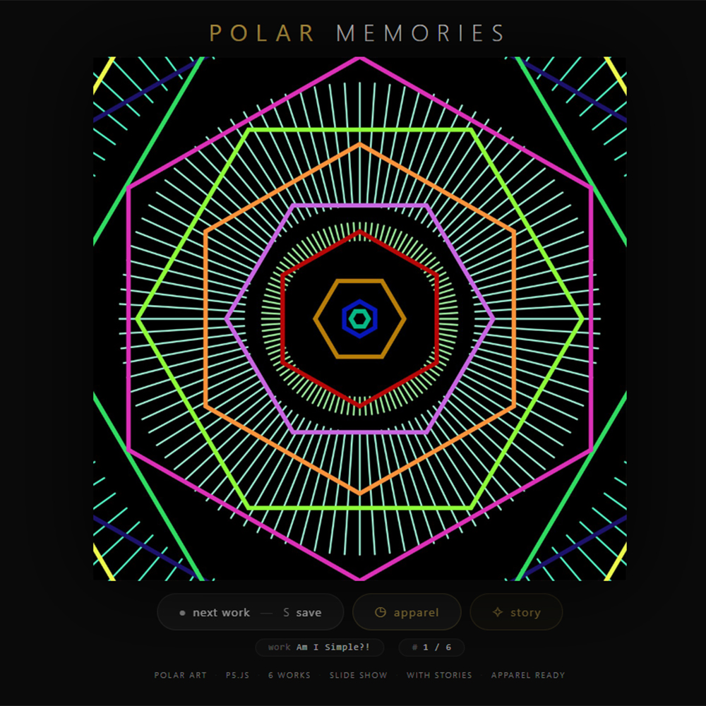
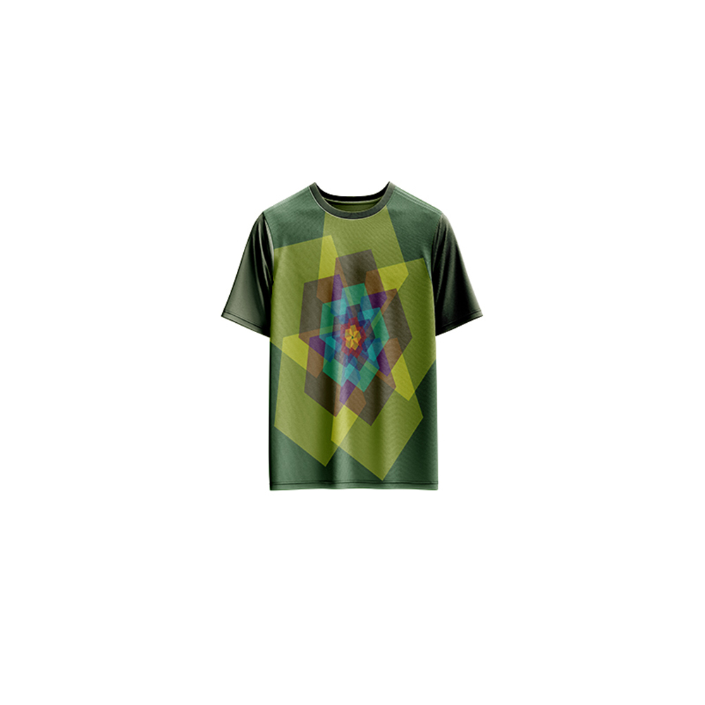

# Polar Memories — Generative Art

[](https://reyrove.github.io/Polar-Memories-Generative-Art)
[](https://opensource.org/licenses/MIT)

> **Generative art meets polar geometry.** A curated collection of 6 generative artworks exploring polar hexagons, geometric patterns, and animated narratives.

## 🎨 Live Demo

<div align="center">
  <a href="https://reyrove.github.io/Polar-Memories-Generative-Art" target="_blank">
    
  </a>
  <br><br>
  <a href="https://reyrove.github.io/Polar-Memories-Generative-Art" target="_blank">
    
  </a>
  <br>
  <em>Click the image or button to experience the generative art</em>
</div>

## 👕 Apparel Preview

<div align="center">
  
  <br>
  <em>Polar Memories artwork printed on a T-shirt</em>
</div>

## ✨ Features

- **6 Unique Works** — A curated collection of polar-inspired generative art
- **Polar Geometry** — Hexagons, ellipses, and geometric patterns
- **Animated GIFs** — Select artworks come to life with motion
- **Storytelling** — Each artwork has its own narrative story
- **Slideshow Navigation** — Browse through the collection
- **Save & Share** — Download any artwork as PNG/GIF
- **Apparel Mode** — Preview artwork on a T-shirt mockup
- **Responsive** — Works on desktop, tablet, and mobile
- **Keyboard Shortcuts**:
  - `→` or `N` — Next work
  - `←` or `P` — Previous work
  - `Space` — Next work
  - `S` — Save image
  - `A` — Toggle apparel
  - `C` — Toggle story

## 🎯 Artworks

| # | Title | Description |
|---|-------|-------------|
| I | **Am I Simple?!** | A vibrant tapestry of polar hexagons exploring the complexity within simplicity. |
| II | **Maybe Another Time...** | A geometric poem where squares, circles, and triangles dance in polar twilight. |
| III | **Nature Dance** | An animated celebration of nature's colors—blue skies, green reflections, and fiery sunsets. *(GIF)* |
| IV | **Cosmic Casino** | A neon-lit 3D box rotating with polar patterns, exploring chance and destiny. *(GIF)* |
| V | **Elements** | A cosmic journey of 28 rotating polar ellipses, telling the story of creation. *(GIF)* |
| VI | **Emerald's Leap** | The adventurous journey of a green spider exploring the vast tapestry of the world. |

## 🚀 Quick Start

### Local Development

```bash
# Clone the repository
git clone https://github.com/reyrove/Polar-Memories-Generative-Art.git

# Navigate to the directory
cd Polar-Memories-Generative-Art

# Open in browser
open index.html
# or use a live server
```

### Deploy to GitHub Pages

1. Push to GitHub
2. Go to Settings → Pages
3. Select branch `main` and root folder
4. Your site will be live at `https://reyrove.github.io/Polar-Memories-Generative-Art`

## 🧠 How It Works

The collection features 6 generative artworks, each created with p5.js and polar geometry:

1. **Artwork Generation**:
   - Polar hexagons and geometric patterns
   - p5.Polar library for polar coordinates
   - Random color palettes and compositions
   - Neon effects and filters

2. **Animation**:
   - Select artworks are animated using p5.js
   - Rotation and movement in polar space
   - GIF export for animated pieces

3. **Storytelling**:
   - Each artwork has a narrative story
   - Stories are revealed in a beautiful modal
   - Roman numerals (I-VI) for chapter-like presentation

4. **Navigation**:
   - Smooth transitions between artworks
   - Keyboard shortcuts for easy browsing
   - Touch-friendly for mobile

## 📁 File Structure

```
Polar-Memories-Generative-Art/
├── index.html              # Main application (all-in-one)
├── am-i-simple.jpg         # Artwork 1
├── maybe-another-time.jpg  # Artwork 2
├── nature-dance.gif        # Artwork 3 (animated)
├── cosmic-casino.gif       # Artwork 4 (animated)
├── elements.gif            # Artwork 5 (animated)
├── emeralds-leap.jpg       # Artwork 6
├── Polar-Memories.jpg      # T-shirt mockup image
├── fav.svg                 # Favicon
├── demo-screenshot.jpg     # Website demo screenshot
├── README.md               # This file
└── LICENSE                 # MIT License
```

## 🛠️ Tech Stack

- **Vanilla HTML/CSS/JS** — No dependencies
- **p5.js** — Generative art creation
- **p5.Polar** — Polar geometry library
- **CSS Flexbox/Grid** — Responsive layout
- **GitHub Pages** — Hosting

## 🎯 Interactive Controls

| Action | Keyboard | Button |
|--------|----------|--------|
| Next Work | `→` or `N` or `Space` | Click "next work" |
| Previous Work | `←` or `P` | — |
| Save Image | `S` | Click "next work" |
| Toggle Apparel | `A` | Click "apparel" |
| Toggle Story | `C` | Click "story" |

## 🎨 Design Inspiration

The collection explores themes of:
- **Polar Geometry** — Hexagons, ellipses, and polar patterns
- **Simplicity & Complexity** — Finding depth in simple forms
- **Nature** — Colors, dance, and organic movement
- **Cosmos** — Creation, elements, and cosmic patterns
- **Adventure** — Exploration and discovery

## 📱 Responsive Design

The application automatically adapts to:
- Desktop screens
- Tablets
- Mobile phones
- Landscape orientation
- Various aspect ratios

## 🤝 Contributing

Contributions are welcome! Feel free to:
- Fork the repository
- Create a feature branch
- Submit a pull request

### Ideas for Contributions:
- Add more polar-inspired artworks
- New geometric patterns
- Enhanced storytelling features
- Performance optimizations

## 📄 License

MIT License — see [LICENSE](LICENSE) file for details.

## 🙏 Acknowledgments

- Created with p5.js and p5.Polar library
- Inspired by polar geometry and generative art
- Special thanks to the creative coding community

---

**Built with ❤️ and polar memories**